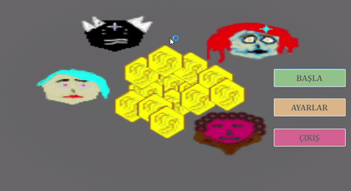

# AltinKapmaca - C# Windows App Uygulaması

## Herkese Selamlar

Bu proje, okul projem olarak yapmış olduğum bir algoritma projesidir. 

Bu projeyi yapmamdaki amaç; C# kullanarak sıra tabanlı çalışan 4 farklı bot algoritmasını bir arada kullanarak bir oyun geliştirmek istememdi. Sonuç olarak böyle bir uygulama ortaya çıktı.

## İçindekiler

0. [Herkese Selamlar](#herkese-selamlar)
1. [Uygulama Hakkında](#uygulama-hakkında)
2. [Botların Hedef Belirlerkenki Kuralları](#botların-hedef-belirlerkenki-kuralları)
3. [Youtube Linki](#youtube-linki)

## Uygulama Hakkında

Bu uygulamada her biri farklı algoritmalar ile çalışmakta olan 4 adet bot birbirleri ile yarışmaktadır. Amaçları oyun tahtası üzerindeki altınları toplamaktır.

Anamenü üzerinde oyunu başlatmadan önce ayarlar kısmından oyun tahtasının boyutunu, altın sayısını, başlangıç altını ve hareket miktarını, her bot için ayrı ayrı hedef belirleme ve hamle yapma maliyetlerini ayarlayabileceğiniz bir arayüz bulunmaktadır. 

Botlar sıraları kendilerine geldiği zaman önceden belirlenen bir hedef yoksa hedef belirler ve hamle yaparlar. Bu eylemlerin belirli bir maaliyeti vardır ve her seferinde envanterlerinden bu maaliyet eksilir.

Hedeflerine ulaşır ve parayı ilk alan olurlarsa envanterlerine o hedefteki paranın miktarı kadar para eklenir. Paraları biterse dururlar. Bütün botların parası bitene kadar veya oyun tahtasındaki bütün paralar toplanana kadar oyun devam eder.

## Botların Hedef Belirlerkenki Kuralları

Bot-1: En yakın altın bulunur.

Bot-2: Maliyetler göz önüne alınarak en kârlı altın bulunur.

Bot-3: Hedef belirlemeden önce 2 gizli altın görünür yapılır. Ardından maliyetler göz önüne alınarak en kârlı altın bulunur.

Bot-4: Diğer oyuncuların kendi hedeflediği altına kendisinden önce ulaşıp ulaşamayacağı ve maliyeti hesaplayarak en kârlı altın bulunur.

## Youtube Linki

Youtube üzerinden paylaştığım uygulama videosuna [bu linkten](https://youtu.be/OdUufD1drgA) ulaşabilirsiniz.
